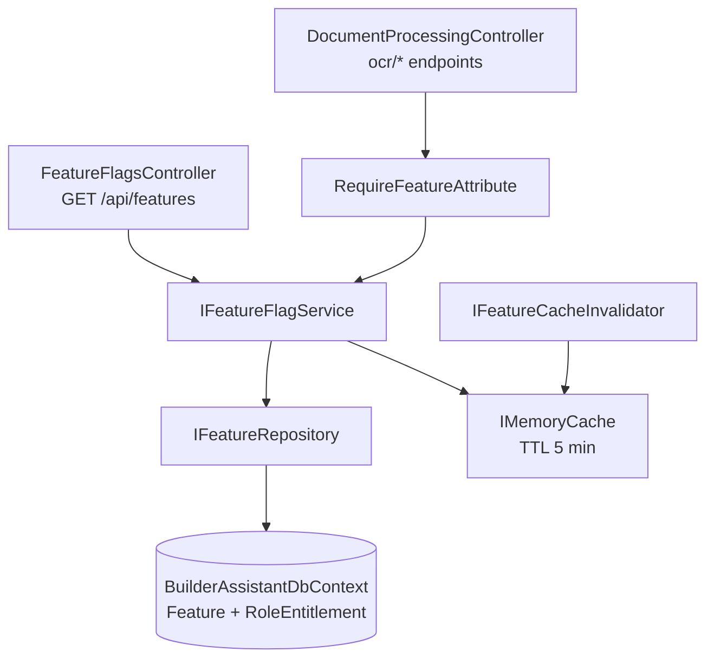

# Design Plan — Permission-based Feature Flags (Issue #17)

**Date:** 2026-05-29  
**Issue:** https://github.com/yhua045/builder-assistant-api/issues/17  
**Mode:** Architect → TDD handoff

---

## 1. Goal

Make mobile-app login optional for basic usage. The API acts as the authoritative source of truth for which features a user may access. The mobile app calls `GET /api/features` at launch to drive UI visibility, while the backend enforces access controls per-request via `RequireFeatureAttribute`.

---

## 2. Architectural Overview

The feature follows the existing **Clean Architecture** layering:

```
Domain      →  Feature, RoleEntitlement entities; IFeatureRepository
Application →  IFeatureFlagService, IFeatureCacheInvalidator, DTOs
Infrastructure → EfFeatureRepository, FeatureFlagService (with IMemoryCache)
Api         →  FeatureFlagsController, RequireFeatureAttribute
Tests       →  Api.Tests (unit), Infrastructure.Tests (unit + integration)
```



---

## 3. Domain Layer — `src/Domain`

### 3.1 New Entities

#### `Feature` (`Domain/Entities/Feature.cs`)

```
Id            long        PK, auto-increment
Key           string      Unique business key (e.g. "ocr_scan"), max 100 chars
Description   string      Human-readable, max 500 chars
DefaultEnabled bool       Baseline value when no user entitlement exists
CreatedAt     DateTimeOffset
```

#### `RoleEntitlement` (`Domain/Entities/RoleEntitlement.cs`)

```
Id         long        PK, auto-increment
RoleName   string      Role name (e.g. "Premium", "Admin"), max 256 chars
FeatureKey string      Matches Feature.Key (no hard FK — allows soft coupling)
Enabled    bool        Per-role override
ExpiresAt  DateTimeOffset?  null = never expires
CreatedAt  DateTimeOffset
```

- No FK to the Users table — entitlements belong to a role, not a user.
- Unique index on `(RoleName, FeatureKey)` — one row per role per feature.
- `ExpiresAt` checked at query time; expired rows are treated as "not entitled".

### 3.2 Repository Interface

#### `IFeatureRepository` (`Domain/Repositories/IFeatureRepository.cs`)

```csharp
Task<IReadOnlyList<Feature>> ListAllAsync(CancellationToken ct = default);
Task<Feature?> GetByKeyAsync(string key, CancellationToken ct = default);
/// <summary>Returns all non-expired entitlements for any of the given role names.</summary>
Task<IReadOnlyList<RoleEntitlement>> ListEntitlementsForRolesAsync(IReadOnlyList<string> roleNames, CancellationToken ct = default);
Task UpsertEntitlementAsync(RoleEntitlement entitlement, CancellationToken ct = default);
Task DeleteEntitlementAsync(string roleName, string featureKey, CancellationToken ct = default);
```

---

## 4. Application Layer — `src/Application`

### 4.1 DTOs (`Application/Dtos/` or inline in service)

#### `FeatureFlagDto`

```csharp
public sealed record FeatureFlagDto(
    string? UserId,
    bool AsAnonymous,
    IReadOnlyList<FeatureItemDto> Flags
);
```

#### `FeatureItemDto`

```csharp
public sealed record FeatureItemDto(
    string Key,
    bool Enabled,
    string Reason,        // "default_on" | "default_off" | "entitlement" | "not_entitled" | "expired" | "role:{name}"
    DateTimeOffset? ExpiresAt
);
```

### 4.2 Service Interface (`Application/Interfaces/IFeatureFlagService.cs`)

```csharp
public interface IFeatureFlagService
{
    /// <summary>
    /// Returns the full flag set for the caller.
    /// <paramref name="userId"/> is used only to populate the response DTO (may be null for anonymous callers).
    /// <paramref name="userRoles"/> drives entitlement resolution; pass an empty list or null for anonymous.
    /// </summary>
    Task<FeatureFlagDto> GetEffectiveFlagsAsync(
        long? userId,
        IReadOnlyList<string>? userRoles,
        CancellationToken ct = default);

    /// <summary>Single-flag check used by RequireFeatureAttribute and service-level enforcement.</summary>
    Task<bool> IsEnabledAsync(
        IReadOnlyList<string>? userRoles,
        string featureKey,
        CancellationToken ct = default);
}
```

### 4.3 Cache Invalidation Interface (`Application/Interfaces/IFeatureCacheInvalidator.cs`)

```csharp
public interface IFeatureCacheInvalidator
{
    /// <summary>Removes the cached flag set for the given role so the next call re-hydrates from DB.</summary>
    void InvalidateRole(string roleName);

    /// <summary>Removes all feature flag cache entries (admin purge).</summary>
    void InvalidateAll();
}
```

**Design note:** Keeping the invalidator as a separate interface allows the cache implementation to be swapped to Redis (`IDistributedCache`) by re-implementing only `IFeatureCacheInvalidator` and the caching logic inside `FeatureFlagService`. The rest of the code is unaffected.

---

## 5. Infrastructure Layer — `src/Infrastructure`

### 5.1 DbContext Changes (`BuilderAssistantDbContext.cs`)

Add:
```csharp
public DbSet<Feature> Features => Set<Feature>();
public DbSet<RoleEntitlement> RoleEntitlements => Set<RoleEntitlement>();
```

`OnModelCreating` additions:

```
Feature:
  - HasKey(e => e.Id)
  - Property(Key).IsRequired().HasMaxLength(100)
  - HasIndex(Key).IsUnique()
  - Property(Description).HasMaxLength(500)
  - Property(DefaultEnabled).IsRequired()

RoleEntitlement:
  - HasKey(e => e.Id)
  - Property(RoleName).IsRequired().HasMaxLength(256)
  - Property(FeatureKey).IsRequired().HasMaxLength(100)
  - HasIndex([RoleName, FeatureKey]).IsUnique()   → IX_RoleEntitlements_RoleName_FeatureKey
  // No FK to AspNetUsers — entitlements belong to a role, not a user
```

### 5.2 EF Core Migration

Name: `AddFeatureFlags`  
Command:
```bash
dotnet ef migrations add AddFeatureFlags \
  --project src/Infrastructure \
  --startup-project src/Api \
  -o Migrations
```

The migration must also seed well-known feature keys and initial role entitlements:

```sql
-- Seed data in migration Up()
INSERT INTO Features (Key, Description, DefaultEnabled, CreatedAt)
VALUES
  ('ocr_scan',      'Optical character recognition for invoices/receipts/quotations', 0, GETUTCDATE()),
  ('high_rate_api', 'Increased API rate limits for batch processing',                  0, GETUTCDATE());

-- Seed role entitlements: Admin role gets all features enabled
INSERT INTO RoleEntitlements (RoleName, FeatureKey, Enabled, ExpiresAt, CreatedAt)
VALUES
  ('Admin', 'ocr_scan',      1, NULL, GETUTCDATE()),
  ('Admin', 'high_rate_api', 1, NULL, GETUTCDATE()),
  ('Premium', 'ocr_scan',   1, NULL, GETUTCDATE());
```

### 5.3 Repository Implementation (`Infrastructure/Repositories/EfFeatureRepository.cs`)

- Implements `IFeatureRepository`
- Uses `AsNoTracking()` for all reads (read-heavy path)
- `UpsertEntitlementAsync`: uses EF `ExecuteUpdateAsync` or find-then-set pattern
- Filters expired entitlements in `ListEntitlementsForRolesAsync`:
  `Where(e => roleNames.Contains(e.RoleName) && (e.ExpiresAt == null || e.ExpiresAt > DateTimeOffset.UtcNow))`

### 5.4 Service Implementation (`Infrastructure/Services/FeatureFlagService.cs`)

Implements both `IFeatureFlagService` and `IFeatureCacheInvalidator`.

**Flag merge logic (priority order, highest wins):**
1. Role entitlement from DB — for each feature, check if any of the user's roles has a `RoleEntitlement` row where `Enabled = true` and not expired → `reason = "role:{roleName}"`
2. Role entitlement explicit disable — if the most specific matching entitlement has `Enabled = false` → `reason = "role:{roleName}:disabled"`
3. Global `Feature.DefaultEnabled` (fallback when no role entitlement applies)

> **Note:** The old per-user Admin shortcut (`all features enabled = true`) is removed. Admin access is now expressed as a `RoleEntitlement` row for `RoleName = "Admin"` with `Enabled = true` for each feature, seeded in the migration.

**Cache behaviour:**
- Cache key: `"features:roles:{role1}+{role2}"` where role names are sorted alphabetically and joined with `+`; `"features:anonymous"` for unauthenticated callers with no roles
- TTL: 5 minutes (configurable via `FeatureFlagOptions.CacheTtlMinutes`)
- `GetEffectiveFlagsAsync` checks cache first, populates on miss
- `InvalidateRole(roleName)` must remove **all** cache entries whose key contains `roleName` (scan by prefix pattern or maintain a role→cacheKey index); `InvalidateAll()` removes by well-known prefix `"features:"`

**Options class** (`Infrastructure/Options/FeatureFlagOptions.cs`):
```csharp
public class FeatureFlagOptions
{
    public int CacheTtlMinutes { get; set; } = 5;
}
```
Registered via `services.Configure<FeatureFlagOptions>(configuration.GetSection("FeatureFlags"))`.

### 5.5 DI Registration (`Infrastructure/DependencyInjection.cs`)

```csharp
// Feature flags
services.Configure<FeatureFlagOptions>(configuration.GetSection("FeatureFlags"));
services.AddMemoryCache(); // idempotent if already added
services.AddScoped<IFeatureRepository, EfFeatureRepository>();
services.AddScoped<IFeatureFlagService, FeatureFlagService>();
services.AddScoped<IFeatureCacheInvalidator>(sp =>
    (IFeatureCacheInvalidator)sp.GetRequiredService<IFeatureFlagService>());
```

---

## 6. API Layer — `src/Api`

### 6.1 `FeatureFlagsController` (`Api/Controllers/FeatureFlagsController.cs`)

```
Route:   [Route("api/features")]
Auth:    [AllowAnonymous]   — optional auth resolved from HttpContext.User
```

**`GET /api/features`**
- Reads `ClaimsPrincipal.FindFirst(ClaimTypes.NameIdentifier)?.Value` to extract `userId` (for DTO population only)
- Reads `ClaimsPrincipal.FindAll(ClaimTypes.Role).Select(c => c.Value).ToList()` to extract `userRoles`
- Delegates to `IFeatureFlagService.GetEffectiveFlagsAsync(userId, userRoles)`
- Returns `200 OK` with `FeatureFlagDto`

**Optional admin sub-routes (protected by `[Authorize(Roles = ApplicationRoles.Admin)]`):**
- `POST /api/features/admin/entitlements` — create/update a role entitlement (`roleName`, `featureKey`, `enabled`, `expiresAt`); calls `IFeatureCacheInvalidator.InvalidateRole(roleName)`
- `DELETE /api/features/admin/entitlements/{roleName}/{featureKey}` — remove entitlement; calls `InvalidateRole(roleName)`

### 6.2 `RequireFeatureAttribute` (`Api/Filters/RequireFeatureAttribute.cs`)

```csharp
[AttributeUsage(AttributeTargets.Class | AttributeTargets.Method, AllowMultiple = true)]
public class RequireFeatureAttribute : Attribute, IAsyncActionFilter
{
    public RequireFeatureAttribute(string featureKey) { ... }

    public async Task OnActionExecutionAsync(ActionExecutingContext context, ActionExecutionDelegate next)
    {
        // 1. Resolve IFeatureFlagService from RequestServices
        // 2. Extract user roles from ClaimsPrincipal.FindAll(ClaimTypes.Role)
        // 3. Call IsEnabledAsync(userRoles, _featureKey)
        // 4. If false → context.Result = new ObjectResult(new ProblemDetails { ... }) { StatusCode = 403 }
        // 5. Otherwise → await next()
    }
}
```

**Wiring onto OCR endpoints** in `DocumentProcessingController`:

```csharp
[HttpPost("ocr/invoices/parse-image")]
[RequireFeature("ocr_scan")]
public async Task<IActionResult> ParseInvoiceImage(...)

[HttpPost("ocr/quotations/parse-image")]
[RequireFeature("ocr_scan")]
public async Task<IActionResult> ParseQuotationImage(...)

[HttpPost("ocr/receipts/parse-image")]
[RequireFeature("ocr_scan")]
public async Task<IActionResult> ParseReceiptImage(...)
```

Text-based OCR endpoints remain open (no feature gate needed) per the issue's intent.

---

## 7. Mobile UI Alignment Notes

> **Action required:** Consult the `mobile-ui` agent with this plan (specifically sections 4.1 and 6.1) to validate the DTO contract and confirm the UI rendering strategy before implementation begins.

Key points surfaced for the mobile-ui agent:

| Concern | API design decision | Expected mobile behaviour |
|---|---|---|
| Anonymous launch | `asAnonymous: true`, flags contain default-only values | Show login CTA in place of premium feature buttons |
| `ocr_scan` disabled | `enabled: false, reason: "default_off"` | Hide/disable the "Scan Document" button; show upsell prompt |
| `ocr_scan` enabled via role | `enabled: true, reason: "role:Premium"` | Show "Scan Document" button normally |
| `expiresAt` non-null | Present in DTO | Display "expires in X days" badge or tooltip |
| Role-derived flag | `reason: "role:{roleName}"` | No change to mobile rendering; reason field is debug metadata |
| Cache TTL | 5-minute server cache | Mobile app should also apply a local 5-minute cache keyed to auth state; invalidate on logout/login |
| Login state change | Mobile triggers re-fetch after login/logout | Ensure the mobile cache is purged before re-calling `GET /api/features` |

---

## 8. Testing Strategy (TDD Order)

All tests must be written **before** the corresponding implementation. The developer agent should follow this red→green→refactor cycle.

### 8.1 Unit Tests — `tests/Api.Tests/Controllers/FeatureFlagsControllerTests.cs`

| Test | Given | Expect |
|---|---|---|
| `GetFlags_Anonymous_ReturnsAnonymousDto` | No auth header | `asAnonymous: true`, flags from defaults |
| `GetFlags_Authenticated_ReturnsUserDto` | Valid userId claim | `asAnonymous: false`, userId set |
| `GetFlags_ServiceThrows_Returns500` | Service throws | 500 response |

Tools: xUnit, Moq for `IFeatureFlagService`.

### 8.2 Unit Tests — `tests/Infrastructure.Tests/Services/FeatureFlagServiceTests.cs`

| Test | Given | Expect |
|---|---|---|
| `GetEffectiveFlags_NoRoles_UsesDefaultEnabled` | Feature.DefaultEnabled=true, no roles | Flag enabled=true, reason="default_on" |
| `GetEffectiveFlags_NoRoles_UsesDefaultDisabled` | Feature.DefaultEnabled=false, no roles | Flag enabled=false, reason="default_off" |
| `GetEffectiveFlags_RoleHasEntitlement_OverridesDefault` | DefaultEnabled=false, RoleEntitlement("Premium", Enabled=true) | enabled=true, reason="role:Premium" |
| `GetEffectiveFlags_MultipleRoles_HighestPrivilegeWins` | Two roles; one has Enabled=false, other Enabled=true | enabled=true (any-enabled wins) |
| `GetEffectiveFlags_ExpiredRoleEntitlement_FallsBackToDefault` | RoleEntitlement.ExpiresAt < UtcNow | enabled=false (default), reason="default_off" |
| `GetEffectiveFlags_CacheKeyIncludesRoles_HitOnSameRoles` | Cache populated for roles ["A","B"] | Hit when roles passed as ["B","A"] (order-independent) |
| `GetEffectiveFlags_CacheMiss_PopulatesCache` | Cache empty | Repository called; result cached |
| `InvalidateRole_RemovesCacheEntriesForRole` | Cache populated for "Premium" | Next call re-queries repository for "Premium" |
| `IsEnabled_DelegatesToGetEffectiveFlags` | Flags contain target key | Returns matching enabled value |

Tools: xUnit, Moq for `IFeatureRepository` and `IMemoryCache`.

### 8.3 Integration Tests — `tests/Infrastructure.Tests/EfFeatureRepositoryTests.cs`

| Test | Given | Expect |
|---|---|---|
| `ListAllAsync_ReturnsAllFeatures` | 2 seeded features | Returns 2 |
| `GetByKeyAsync_ExistingKey_ReturnsFeature` | Seeded feature | Not null |
| `GetByKeyAsync_MissingKey_ReturnsNull` | No matching row | null |
| `ListEntitlementsForRoles_FiltersExpired` | One valid + one expired entitlement for "Premium" | Returns only valid |
| `ListEntitlementsForRoles_MultipleRoles_ReturnsAll` | Entitlements for "Premium" and "Admin" | Returns both |
| `UpsertEntitlementAsync_NewRow_Inserts` | No existing row | Row count +1 |
| `UpsertEntitlementAsync_ExistingRow_Updates` | Existing row | Row updated, count unchanged |
| `DeleteEntitlementAsync_RemovesRow` | Existing row for "Premium" + "ocr_scan" | Row removed |

Tools: xUnit, EF InMemory (same pattern as `EfImageRepositoryTests`).

### 8.4 Integration Tests — `tests/Api.Tests/Controllers/FeatureFlagsControllerIntegrationTests.cs`

| Test | Given | Expect |
|---|---|---|
| `GetFeatures_NoToken_Returns200WithAnonymousDto` | No auth | 200, `asAnonymous: true` |
| `GetFeatures_ValidToken_Returns200WithUserDto` | Valid bearer | 200, `asAnonymous: false`, userId matches |
| `OcrEndpoint_NoMatchingRoleEntitlement_Returns403` | `ocr_scan` defaultEnabled=false, user has no entitled role | 403 |
| `OcrEndpoint_UserRoleHasEntitlement_Returns200` | User has "Premium" role with `ocr_scan` RoleEntitlement enabled | Proceeds to next handler |

Tools: `WebApplicationFactory<Program>` or similar in-process test host.

---

## 9. Configuration

Add to `appsettings.json`:

```json
{
  "FeatureFlags": {
    "CacheTtlMinutes": 5
  }
}
```

---

## 10. File Checklist (new files only)

```
src/Domain/Entities/Feature.cs
src/Domain/Entities/RoleEntitlement.cs
src/Domain/Repositories/IFeatureRepository.cs
src/Application/Dtos/FeatureFlagDto.cs
src/Application/Dtos/FeatureItemDto.cs
src/Application/Interfaces/IFeatureFlagService.cs
src/Application/Interfaces/IFeatureCacheInvalidator.cs
src/Infrastructure/Options/FeatureFlagOptions.cs
src/Infrastructure/Repositories/EfFeatureRepository.cs
src/Infrastructure/Services/FeatureFlagService.cs
src/Api/Controllers/FeatureFlagsController.cs
src/Api/Filters/RequireFeatureAttribute.cs
tests/Api.Tests/Controllers/FeatureFlagsControllerTests.cs
tests/Api.Tests/Controllers/FeatureFlagsControllerIntegrationTests.cs
tests/Infrastructure.Tests/Services/FeatureFlagServiceTests.cs
tests/Infrastructure.Tests/EfFeatureRepositoryTests.cs   (new test cases added)
```

**Modified files:**

```
src/Infrastructure/BuilderAssistantDbContext.cs          (add DbSets + model config; UserEntitlements → RoleEntitlements)
src/Infrastructure/DependencyInjection.cs                (register new services)
src/Api/Controllers/DocumentProcessingController.cs      (add [RequireFeature] attrs)
src/Infrastructure/Migrations/                           (new AddFeatureFlags migration)
appsettings.json                                         (FeatureFlags section)
```

---

## 11. Open Questions / Decisions

| # | Question | Recommended default |
|---|---|---|
| 1 | Should text-based OCR endpoints (`parse-text`) also be gated by `ocr_scan`? | No — text parsing is lower cost; gate image endpoints only |
| 2 | Should the admin entitlement endpoints be in a separate `AdminController`? | Keep in `FeatureFlagsController` under `/api/features/admin` for now; extract if it grows |
| 3 | Distributed cache (Redis) swap — when? | Out of scope for this issue; `IFeatureCacheInvalidator` abstraction is already in place |
| 4 | Feature key registry — code constants or DB-driven? | DB-driven with migration seed; add `ApplicationFeatures` static class with `const string` keys for compile-time safety |
| 5 | Rate-limit integration with `high_rate_api` flag | Deferred — out of scope for this issue |

---

## 12. Handoff to `developer` Agent

**Design document location:** `/Users/boqi/BuilderAssistantApi/design/plan.md`

**Mobile UI agent:** This plan has been shared with the `mobile-ui` agent for review of the DTO contract (sections 4.1 and 7). Confirm alignment before implementing `FeatureFlagsController` response shape.

---

*Architecture reviewed and ready for TDD implementation.*
